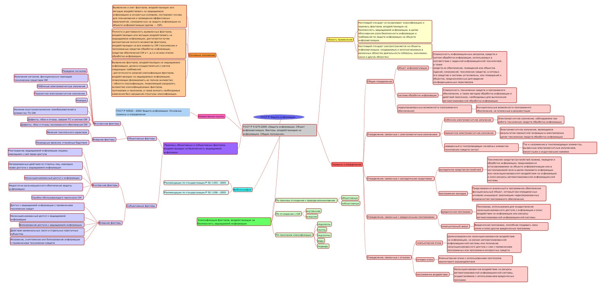

# Изучение ГОСТ
Солдатенкова Ксения

## Цель работы

Изучить ГОСТ по защите информации и познакомиться с построением
mind-карты

## Ход работы

1.  Для построения mind-карты был взят ГОСТ Р 51275-2006 Защита
    информации. Объект информатизации. Факторы, воздействующие на
    информацию. Общие положения. Ссылка на документ -
    https://ohranatruda.ru/upload/iblock/fb6/4294812634.pdf

2.  Была использована программа Freeplane

3.  Результат 

## Оценка результата

Был изучен ГОСТ Р 51275-2006 Защита информации. Объект информатизации.
Факторы, воздействующие на информацию. Общие положения и была построена
mind-карта в программе Freeplane.

## Вывод

Таким образам, был изучен ГОСТ и правила построения mind-карт.
